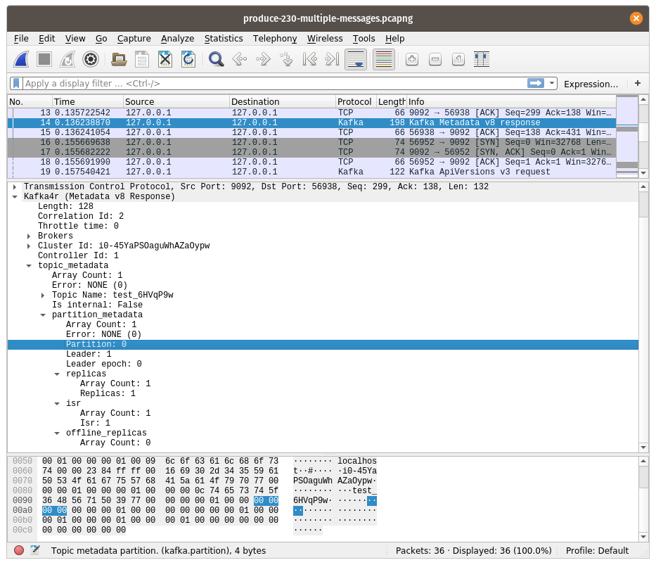

# Kafka dissector plugin for Wireshark



## Install
Currently compiles for Wireshark-v3.6. Need to think how to compile for multiple versions.
Packages are planned, for now:
```
sudo apt install libclang-dev clang wireshark-dev
cargo build --release
mkdir -p $HOME/.local/lib/wireshark/plugins/3.6/epan/
cp target/release/libkafka_plugin.so $HOME/.local/lib/wireshark/plugins/3.6/epan/
```

Make sure that `wireshark` have picked up the plugin.
* Restart Wireshark
* Go to Help/About Wireshark/Plugins
* Search for `libkafka_plugin` name.
* If nothing, check where your plugin dir is in Help/About Wireshark/Folders/Personal Plugins

## TODO
- [ ] Compression decoding
- [ ] Compile for wireshark-v2.x
- [ ] Publish .dpg
- [ ] Publish on Brew (Osx)

## Supported ApiKeys and max supported version
| ApiKey                           | Max |
|----------------------------------|:---:|
| Produce	                       | 7   |
| Fetch					|  10  |
| ListOffsets					|  5  |
| Metadata					|  7  |
| LeaderAndIsr					|  2  |
| StopReplica					|  1  |
| UpdateMetadata					|  5  |
| ControlledShutdown					|  2  |
| OffsetCommit					|  6  |
| OffsetFetch					|  5  |
| FindCoordinator					|  2  |
| JoinGroup					|  4  |
| Heartbeat					|  2  |
| LeaveGroup					|  2  |
| SyncGroup					|  2  |
| DescribeGroups					|  2  |
| ListGroups					|  2  |
| SaslHandshake					|  1  |
| ApiVersions					|  2  |
| CreateTopics					|  3  |
| DeleteTopics					|  3  |
| DeleteRecords					|  1  |
| InitProducerId					|  1  |
| OffsetForLeaderEpoch					|  2  |
| AddPartitionsToTxn					|  1  |
| AddOffsetsToTxn					|  1  |
| EndTxn					|  1  |
| WriteTxnMarkers					|  0  |
| TxnOffsetCommit					|  2  |
| DescribeAcls					|  1  |
| CreateAcls					|  1  |
| DeleteAcls					|  1  |
| DescribeConfigs					|  2  |
| AlterConfigs					|  1  |
| AlterReplicaLogDirs					|  1  |
| DescribeLogDirs					|  1  |
| SaslAuthenticate					|  1  |
| CreatePartitions					|  1  |
| CreateDelegationToken					|  1  |
| RenewDelegationToken					|  1  |
| ExpireDelegationToken					|  1  |
| DescribeDelegationToken					|  1  |
| DeleteGroups					|  1  |
| ElectPreferredLeaders					|  0  |
